# 一 、学习环境准备

这里推荐一个中文nginx手册

```
http://tengine.taobao.org/book/index.html
```

上面这个手册是阿里巴巴开源出来的，但是阅读需要门槛

另外如果以下的配置内容有报错的话，建议参考如下代码库查看

```
https://git.imooc.com/
```

不过这个代码库需要账号密码才能查看，嘿嘿

系统环境：

Centos7 

配置虚拟主机名：

```
hostnamectl set-hostname node01
```

然后执行logout重新登陆即可

配置静态IP

```
vim /etc/sysconfig/network-scripts/ifcfg-ens33
```

修改ipaddr的值

然后重启网卡

```
systemctl restart network
```


## 1.1安装基本库

```
yum -y install gcc gcc-c++ autoconf pcre pcre-devel make automake
```

## 1.2安装基本工具

```
yum -y install wget httpd-tools vim
```

## 1.3初始化目录

```
cd /opt
mkdir app download logs work backup
```

## 1.4关闭iptables规则

## 1.5关闭selinux

# 二、nginx初识

## 2.1nginx简述

nginx是一个开源且高性能、可靠的http中间件、代理服务

采用IO多路复用的epoll模型

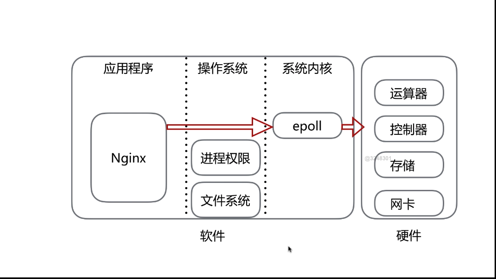

cpu亲和

nginx的sendfile

## 2.2nginx的安装

### 2.2.1 版本概述

Mainline version ---开发版本

Stable version -- 稳定版本  用于实际生产

Legacy version -- 历史版本

### 2.2.2版本选择

Nginx-1.21.1

### 2.2.3安装步骤

参考安装地址：

```
http://nginx.org/en/linux_packages.html
```

使用这种方式使用rpm包安装的。

安装完成输入一下命令查看版本

```
nginx -v
```

查看编译参数用

```
nginx -V
```

如果我们想自己去用编译安装的方式，那么对于这些参数的了解是必须的

```
/usr/sbin/nginx # 启动命令
/usr/sbin/nginx -s stop # 停止命令
/usr/sbin/nginx -s reload # 重新加载
```


## 2.3nginx安装目录讲解

### 2.3.1查看当前nginx的安装目录命令

```
rpm -ql nginx
```

### 2.3.2各目录功能

| 路径                                                         | 作用                                       |
| ------------------------------------------------------------ | ------------------------------------------ |
| /etc/logratate.d/nginx                                       | nginx日志轮转，用于logrotate服务的日志切割 |
| /etc/nginx<br />/etc/nginx/nginx.conf<br />/etc/nginx/conf.d<br />/etc/nginx/conf.d/default.conf | nginx的主配置文件                          |
| /etc/nginx/fastcgi_params<br />/etc/nginx/uwsgi_params<br />/etc/nginx/scgi_params | cgi配置相关，fastcgi配置                   |
| /etc/nginx/koi-utf<br />/etc/nginx/koi-win<br />/etc/nginx/win-utf | 编码转换映射转化文件                       |
| /etc/nginx/mime.types                                        | 设置http协议的content-Type与扩展名对应关系 |
| /usr/lib/systemd/system/nginx-debug.service<br />/usr/lib/systemd/system/nginx.service<br />/etc/sysconfig/nginx<br />/etc/sysconfig/nginx-debug | 用于配置出系统守护进程管理器管理方式       |
| /usr/lib64/nginx/modules<br />/etc/nginx/modules             | nginx模块目录                              |
| /usr/sbin/nginx<br />/usr/sbin/nginx-debug                   | nginx服务的启动管理的终端命令              |
| /usr/share/doc/nginx-1.12.0<br />/usr/share/doc/nginx-1.12.0/COPYRIGHT<br />/usr/share/man/man8/nginx.8.gz | nginx的手册和帮助文件                      |
| /var/cache/nginx                                             | nginx的缓存目录                            |
| /var/log/nginx                                               | nginx的日志目录                            |

## 2.4nginx的安装编译参数

关于编译参数这一块，官网有个链接详细讲解了

```
http://nginx.org/en/docs/configure.html
```

| 编译选项                                                     | 作用                                          |
| ------------------------------------------------------------ | --------------------------------------------- |
| --prefix=/etc/nginx<br />--sbin-path=/usr/sbin/nginx<br />--modules-path=/usr/lib64/nginx/modules<br />--conf-path=/etc/nginx/nginx.conf<br />--error-log-path=/var/log/nginx/error.log<br />--http-log-path=/var/log/nginx/access.log<br />--pid-path=/var/run/nginx.pid<br />--lock-path=/var/run/nginx.lock | 安装目录或者路径                              |
| --http-client-body-temp-path=/var/cache/nginx/client_temp<br />--http-proxy-temp-path=/var/cache/nginx/proxy_temp<br />--http-fastcgi-temp-path=/var/cache/nginx/fastcgi_temp<br />--http-uwsgi-temp-path=/var/cache/nginx/uwsgi_temp<br />--http-scgi-temp-path=/var/cache/nginx/scgi_temp | 执行对应模块时<br />，nginx所保留的临时性文件 |
| --user=nginx<br />--group=nginx                              | 设定nginx进程启动的用户<br />和组用户         |
| --with-cc-opt=parameters                                     | 设置额外的参数将被添加到<br />CFLAGS变量      |
| --with-ld-opt=parameters                                     | 设置附加的参数，链接系统库                    |

## 2.5nginx配置文件的编写

| 名称             | 作用                        |
| ---------------- | --------------------------- |
| user             | 设置nginx服务的系统使用用户 |
| worker_processes | 工作进程数                  |
| error_log        | nginx的错误日志             |
| pid              | nginx的服务启动时候pid      |


events模块列表

| 名称               | 作用                   |
| ------------------ | ---------------------- |
| worker_connections | 每个进程允许最大连接数 |
| use                | 工作进程数             |

## 2.6nginx.conf的server模块初步探索

```
server {
    listen       80; # 监听的端口
    server_name  localhost; # 监听的域名

    # 监听的根目录
    location / {
        # 静态文件存贮的目录
        root   /usr/share/nginx/html;
        # 默认寻找的文件
        index  index.html index.htm;
    }
    # 定义文件50x之后寻找的文件
    error_page   500 502 503 504  /50x.html;
    # 当访问50x目录文件之时
    location = /50x.html {
        # 定义50x放置的目录
        root   /usr/share/nginx/html;
    }
}
```

## 2.7配置nginx的虚拟主机

### 2.7.1基于主机多IP的方式（单网卡）

首先先在Linux的网卡上绑定多个IP

```
ip a # 查看网卡绑定
ip a add 192.168.200.21/24 dev eth0 # 对同一个网卡进行绑定新的IP地址
```

更改配置文件，主要修改server

```
server {
    listen       80; # 以前这里监听的是80端口，现在基于IP的话，要改成确定的IP地址 192.168.200.20:80
    server_name  localhost; # 监听的域名
    
    .....
```

增加两个server，然后再修改访问的目录地址

```
server {
    listen       80; # 监听的端口
    server_name  localhost; # 监听的域名

    # 监听的根目录
    location / {
        # 静态文件存贮的目录
        root   /usr/share/nginx/html; # 两个server的这里指定不同的地址，既可以部署不同的服务
        # 默认寻找的文件
        index  index.html index.htm;
    }
```

以下是改后的两个文件

server1.conf

```
server {
    listen       192.168.200.20:80; # 监听的端口
    server_name  localhost; # 监听的域名

    # 监听的根目录
    location / {
        # 静态文件存贮的目录
        root   /home/webserver1;
        # 默认寻找的文件
        index  index.html index.htm;
    }
    # 定义文件50x之后寻找的文件
    error_page   500 502 503 504  /50x.html;
    # 当访问50x目录文件之时
    location = /50x.html {
        # 定义50x放置的目录
        root   /usr/share/nginx/html;
    }
}
```

server2.conf

```
server {
    listen       192.168.200.21:80; # 监听的端口
    server_name  localhost; # 监听的域名

    # 监听的根目录
    location / {
        # 静态文件存贮的目录
        root   /home/webserver2;
        # 默认寻找的文件
        index  index.html index.htm;
    }
    # 定义文件50x之后寻找的文件
    error_page   500 502 503 504  /50x.html;
    # 当访问50x目录文件之时
    location = /50x.html {
        # 定义50x放置的目录
        root   /usr/share/nginx/html;
    }
}
```

然后重启nginx

```
nginx -s reload -c /etc/nginx/nginx.conf
```

### 2.7.2基于端口的方式

删除之前一个网卡绑定的多个IP

```
ip a del 192.168.200.21/24 dev ens33
```


Server1.conf

```
server {
    listen       80; # 监听的端口
    server_name  localhost; # 监听的域名

    # 监听的根目录
    location / {
        # 静态文件存贮的目录
        root   /home/webserver2;
        # 默认寻找的文件
        index  index.html index.htm;
    }
    # 定义文件50x之后寻找的文件
    error_page   500 502 503 504  /50x.html;
    # 当访问50x目录文件之时
    location = /50x.html {
        # 定义50x放置的目录
        root   /usr/share/nginx/html;
    }
}
```

Server2.conf

```
server {
    listen       81; # 监听的端口
    server_name  localhost; # 监听的域名

    # 监听的根目录
    location / {
        # 静态文件存贮的目录
        root   /home/webserver2;
        # 默认寻找的文件
        index  index.html index.htm;
    }
    # 定义文件50x之后寻找的文件
    error_page   500 502 503 504  /50x.html;
    # 当访问50x目录文件之时
    location = /50x.html {
        # 定义50x放置的目录
        root   /usr/share/nginx/html;
    }
}
```

主要修改的是端口号码

重启nginx

检查配置文件的语法是否正确

```
nginx -tc /etc/nginx/nginx.conf
```

查看本机监听端口命令

```
ss -luntp
```

### 2.7.3基于host名称的方式

因为我这次演示用的是本机搭建虚拟主机的方式，所以需要配置虚拟host

vim /etc/hosts

```
192.168.200.20 1.test.com
192.168.200.20 2.test.com
```

server2.conf

```
server {
    listen       80; # 监听的端口
    server_name  1.test.com; # 监听的域名

    # 监听的根目录
    location / {
        # 静态文件存贮的目录
        root   /home/webserver2;
        # 默认寻找的文件
        index  index.html index.htm;
    }
    # 定义文件50x之后寻找的文件
    error_page   500 502 503 504  /50x.html;
    # 当访问50x目录文件之时
    location = /50x.html {
        # 定义50x放置的目录
        root   /usr/share/nginx/html;
    }
}
```

Server2.conf

```
server {
    listen       80; # 监听的端口
    server_name  2.test.com; # 监听的域名

    # 监听的根目录
    location / {
        # 静态文件存贮的目录
        root   /home/webserver2;
        # 默认寻找的文件
        index  index.html index.htm;
    }
    # 定义文件50x之后寻找的文件
    error_page   500 502 503 504  /50x.html;
    # 当访问50x目录文件之时
    location = /50x.html {
        # 定义50x放置的目录
        root   /usr/share/nginx/html;
    }
}
```

重启nginx

## 2.8nginx的日志

关于这一部分可以参考官网的配置地址：

```
http://nginx.org/en/docs/syslog.html
```

包括error.log 和 access_log

log_format配置在http模块下面

先来认识一下nginx.conf文件

```
user  nginx; # 指定用哪个用户，用yum安装的时候会自动创建nginx用户
worker_processes  1;

error_log  /var/log/nginx/error.log warn;  # 这里指定错误日志目录 warn表示记录到warn级别
pid        /var/run/nginx.pid;  # 指定配置文件目录


events {
    worker_connections  1024;
}


http {
    include       /etc/nginx/mime.types;
    default_type  application/octet-stream;

		# 主要是这里定义格式 log_format 这个内容目前学到的内容只能在http这个模块内部定义
    log_format  main  '$remote_addr - $remote_user [$time_local] "$request" '
                      '$status $body_bytes_sent "$http_referer" '
                      '"$http_user_agent" "$http_x_forwarded_for"';
                      
		# 这里定义access_log的目录地址，然后后面指定了main，这个main就是上面log_format后面的main
    access_log  /var/log/nginx/access.log  main;

    sendfile        on;
    #tcp_nopush     on;

    keepalive_timeout  65;

    #gzip  on;

    include /etc/nginx/conf.d/*.conf;
}
```

log_format常见的变量含义

| 变量                 | 描述               |
| -------------------- | ------------------ |
| remote_addr          | 客户端的地址       |
| remote_user          | http 请求的用户名  |
| time_local           | nginx的时间        |
| request              | 请求头的请求行     |
| status               | 返回的状态         |
| body_bytes_sent      | body信息的大小     |
| http_referer         | 请求的上一级页面   |
| http_user_agent      | 客户端的user_agent |
| http_x_forwarded_for | 协议的标准头       |

## 2.9nginx的模块

这个部分分为nginx的官方模块和第三方的模块

在nginx -V 命令展示出来的以--with开头的都是模块

### 2.9.1 http_stub_status_module

作用：主要用于展示nginx的客户端状态

现在来认识一下官方文档关于配置的一个描述查看信息

配置分为三个部分，分别为Syntax、Default、Context

```
# 这个表示写配置文件时候的名称
Syntax: stub_status;
# 这个表示这个配置名称的默认值 横杠表示没有开启
Default:-
# 这个指定上面的配置是在哪个地方可以配置
Context:server,location
```

打开server1.conf

找到server模块加入一下信息

```
location /mystatus {
    stub_status;
}
```

然后重启nginx

打开浏览器输入

```
192.168.200.20/mystatus
```

就会看到当前nginx的信息，包括当前的连接数，历史连接数，是否丢失数据数字等

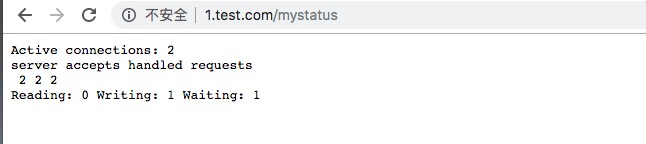

### 2.9.2 http_random_index_module

作用：目录中选择一个随机主页,说的简单点就是当在浏览器刷新的时候，会在配置目录随便选择一个文件展示

配置语法

```
Syntax: random_index on | off;
Default: random_index off;
Context:location
```

首先修改server的location内容，原本内容如下

```
# 监听的根目录
location / {
  # 静态文件存贮的目录
  root   /home/webserver2;
  # 默认寻找的文件
  index  index.html index.htm;
}
```

这个时候修改如下

```
# 监听的根目录
location / {
  # 静态文件存贮的目录
  root   /home/webserver2;
  # 默认寻找的文件
  # index  index.html index.htm; # 注释掉原本想要寻找的index.html等文件
  # 开启随机访问目录下面的文件，这里需要注意，对于以.开头的隐藏文件不会被访问到
  random_index on; 
}
```

然后在/home/webserver2下面多写几个不同的文件

然后打开浏览器刷新，多刷新几次，就会看到访问的文件内容是不同的。

### 2.9.3 http_sub_module

作用：返回的http 内容替换

语法：

```
# string 表示要替换的内容 replacement表示替换后的内容
Syntax: sub_filter string replacement
# 默认是没有配置的
Default: -
Context:http,server,location
```

语法2:

```
Syntax:sub_filter_last_modified on | off;
Default:sub_filter_last_modified off;
Context:http,server,location
```

这个主要用于校验服务端的内容是否发生改变，如果更新则返回最新的内容，如果没有更新则不会返回，这个在高并发的调优中可以使用到，通过这个参数可以不用每次都返回html内容，节省带宽，主要用于缓存里面


语法3:

```
Syntax: sub_filter_once on | off;
Default: sub_filter_once on;
Context: http,server,location
```

这个的作用是指定配置的位置，如果是on的话就只匹配第一个，如果是off则把html的所有符合第一个语法配置的内容给匹配到


演示：

在webserver1的index.html文件中修改如下

```
gg
gg
gg
```

然后修改配置文件

```
# 监听的根目录
location / {
  # 静态文件存贮的目录
  root   /home/webserver2;
  # 默认寻找的文件
  index  index.html index.htm; 
  sub_filter 'gg' 'GG';
}
```

然后重启nginx

访问首页，会发现如下

```
GG
gg
gg
```

可以看出来第一个gg被替换成了GG，但是默认的匹配是只匹配第一个，于是加入如下配置

```
# 监听的根目录
location / {
  # 静态文件存贮的目录
  root   /home/webserver2;
  # 默认寻找的文件
  index  index.html index.htm; 
  sub_filter 'gg' 'GG';
  sub_filter_once off;
}
```

这个时候浏览器访问就会如下：

```
GG
GG
GG
```

所有的都被匹配到了

### 2.9.4 nginx的请求限制

limit_conn_module : 连接频率限制

limit_req_module：请求频率限制

连接限制的配置语法：

语法1:

```
# key 如请求的IP等 name定义之后为语法2使用 ,会开辟一块以size大小的内存空间，存贮过来的连接
Syntax: limit_conn_zone key zone=name:size;
Default: -
Context: http
```

语法2:

```
# 这里的zone就是上面的name ，number表示要限制的数量
Syntax: limit_conn zone number;
Default: -
Context: http,server,location
```


请求限制的配置语法：

语法1:

```
# rate表示速率
Syntax: limit_req_zone key zone=name:size rate=rate;
Default: -
Context: http
```

语法2:

```
Syntax: limit_req zone=name [burst=number] [nodelay];
Default: -
Context: http,server,location
```


无论是连接限制还是请求限制，语法1和语法2都要配合使用，语法1只是开辟空间作为记录，语法2是真的限制配置，这一部分测试的话可以用ab压测工具进行测试。


## 2.10 nginx的访问控制

基于IP的访问控制 ：http_access_module

基于用户的信任登陆 : http_auth_basic_module

### 2.10.1 http_access_module

语法1：

```
# address 表示IP ，CIDR表示限制网断， unix: 表示基于限制socket
Syntax: allow address | CIDR | unix: | all;
Default: -
Context: http,server,location,limit_except
```

语法2：

```
Syntax: deny address | CIDR | unix: | all;
Default: -
Context: http,server,location,limit_except
```

实验：

本次实验主要基于IP的限制来做，我的本机IP是192.168.200.1，我想限制他不允许访问 /admin.html页面

配置文件如下：

```
# ～表示匹配   ^ 表示以什么开头的内容 ，这里表示的是以/admin.html开头的页面
location ~ ^/admin.html {
   root /home/webserver1;
   index index.html index.htm;
   # 这里是不允许哪个IP进行访问
   deny 192.168.200.1;
   # 这里是配置允许所有的IP进行访问
   allow all;
}
```

上面 的需要注意，如果不允许的话，需要先配置在前面，然后再配置允许，否则，不允许的IP将会失效

然后打开浏览器访问，会发现页面无法访问。

在实际企业中，对于后台，我们可能只允许某个IP进行访问，所以这个时候可以如下配置。

```
# ～表示匹配   ^ 表示以什么开头的内容 ，这里表示的是以/admin.html开头的页面
location ~ ^/admin.html {
   root /home/webserver1;
   index index.html index.htm;
   # 这里是不允许哪个IP进行访问
   allow 192.168.200.1;
   # 这里是配置允许所有的IP进行访问
   deny all;
}
```

局限性：

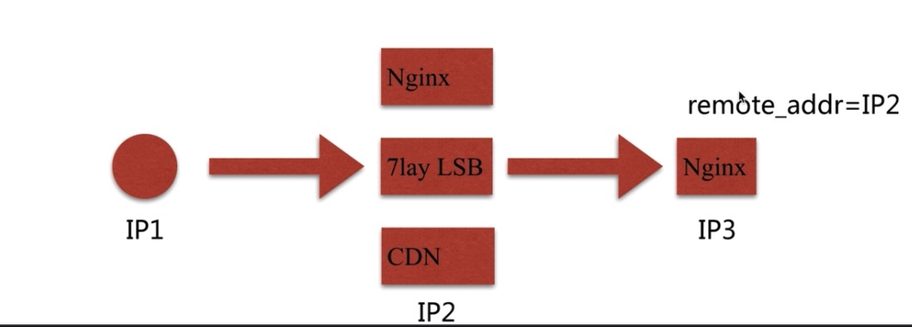


我们想像这样一种场景，我们在IP3做了基于IP的访问限制，这个时候经过了中间IP2的处理之后，传递到IP3的IP是 IP2，我们要限制的是IP1，所以起不到作用了。

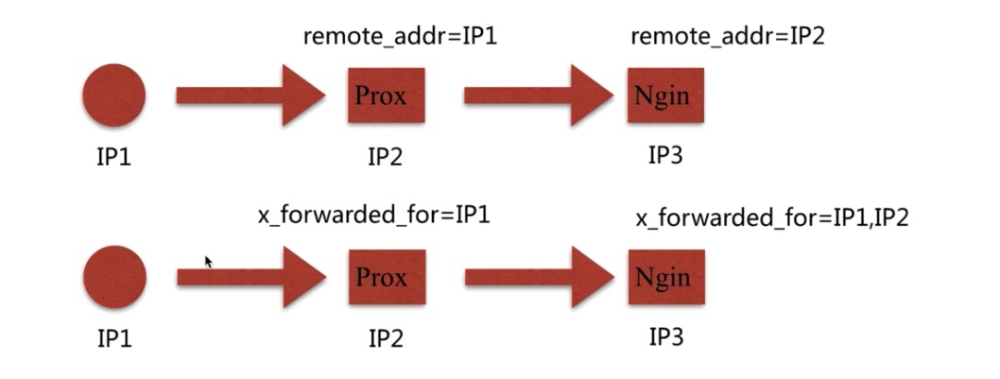

之前我们用remote_addr是有局限性的，那么现在我们换成x_forwarded_for，这个就不一样的了，他传递给IP3的实际上即有IP1，又有IP2。

解决方案


但是x_forwarde_for也是有问题，因为他只是一个http的头信息，对于头信息是可以任意更改的。于是我们用这种方式也是不太可取，那么我们可以采用自定义变量的传递方式，比如我们在IP2自定义一个变量传递到IP3.

### 2.10.2 http_auth_basic_module

作用：用户登陆认证的模块

语法1:

```
Syntax: auth_basic string | off;
Default: auth_basic off;
Context:http,server,location,limit_except
```

语法2:

```
# 用来存住用户名密码的文件
Syntax: auth_basic_user_file file;
Default: -
Context: http,server,location,limit_except
```

实验：

关于本节的说明可以查看官网文档，地址是：

```
http://nginx.org/en/docs/http/ngx_http_auth_basic_module.html
```


使用htpasswd命令生成放置账号密码的文件

```
htpasswd -c ./auth_access root
```

这个时候就会在当前文件夹看到新生成一个叫auth_access的文件

然后修改配置文件

```
location ~ ^/admin.html {
   root /home/webserver1;
   index index.html index.htm;
   # 这里开启权限验证
   auth_basic "please input your password!";
   # 这里配置权限验证的账号密码的文件
   auth_basic_user_file /etc/nginx/auth_access;
}
```

修改完毕，重启nginx

打开浏览器就会有弹框弹出来，这个时候输入之前填写的账号密码就可以登陆了。

局限性：

1.用户信息依赖文件方式

2.操作管理机械，效率低下

解决方案：

nginx结合lua实现高效验证

# 三、nginx的场景实战

## 3.1nginx作为静态资源web服务

### 3.1.1 静态资源

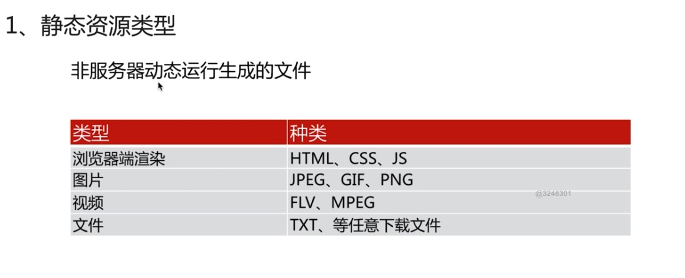


### 3.1.2 CDN

CDN 又称内容分发网络，如下图

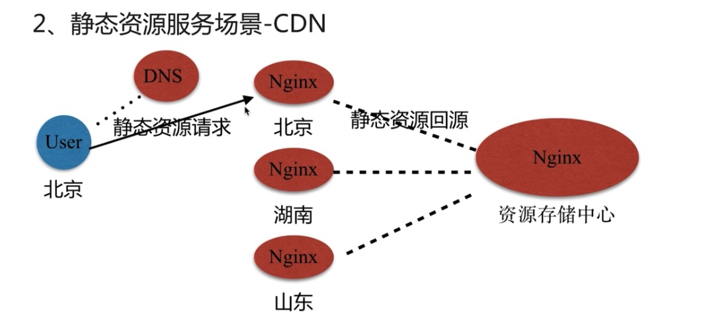

我们可以看到资源存贮中心在某一个地方，用户在北京，这个时候用户想要请求静态资源需要经过很长的时间的路由，那么资源存贮中心就可以将资源先分发到各个节点上，这个时候用户去请求北京的节点，就省去了路由的时间。

### 3.1.3 文件读取

配置语法

```
Syntax: sendfile on | off;
Default: sendfile off;
Context: http,server,location,if in location
```

作用：简单来说就是sendfile可以减少文件的拷贝次数，提高性能，这个在作为静态资源web服务的时候开启可以显著的提高性能

参考文章：

[http://xiaorui.cc/2015/06/24/%E6%89%AF%E6%B7%A1nginx%E7%9A%84sendfile%E9%9B%B6%E6%8B%B7%E8%B4%9D%E7%9A%84%E6%A6%82%E5%BF%B5/](http://xiaorui.cc/2015/06/24/扯淡nginx的sendfile零拷贝的概念/)

配置语法：tcp_nopush

```
Syntax: tcp_nopush on | off;
Default: tcp_nopush off;
Context: http,server,location
```

作用：sendfile开启的情况下，提高网络包的传输效率，简单的理解就是将多次的报文打包成一次进程传输

配置语法：tcp_nodelay

```
Syntax: tcp_nodelay on | off;
Default: tcp_nodelay on;
Context: http,server,location
```

作用：keepalive连接下，提高网络包的传输实时性。

配置语法：压缩

```
Syntax: gzip on | off;
Default: gzip off;
Context: http,server,location,if in location
```

作用：压缩传输，减少网络传输的带宽,这里需要注意，压缩是服务器端来压缩的，然后传输到浏览器端，浏览器来进行解压缩。

配置语法：压缩比率

```
Syntax: gzip_comp_level level;
Default: gzip_comp_level 1;
Context: http,server,location
```

压缩的比率可以节省带宽，但是压缩本身也消耗服务器的资源

配置语法： 压缩的版本

```
Syntax: gzip_http_version 1.0 | 1.1;
Default: gzip_http_version 1.1;
Context: http,server,location
```

控制gzip的版本

### 3.1.4 扩展nginx压缩模块

http_gzip_static_module : 预读gzip功能

http_gunzip_module ：应用支持gunzip的压缩方式

压缩试验一：

在/home/webserver1/images文件中传入jpg图片

```
http://img2.imgtn.bdimg.com/it/u=2300914240,305787334&fm=15&gp=0.jpg
```

然后修改server文件

```
location ~ .*\.(jpg|gif|png)$ {
   root /home/webserver1/images;
}
```

然后打开浏览器访问

这里1.jpg就是上面那张图片修改之后的名字

```
192.168.200.20/1.jpg
```

然后打开开发者工具，查看


在server中配置如下：

```
# 匹配任何以jpg、gif、png结尾的文件
location ~ .*\.(jpg|gif|png)$ {
     # 开启gzip压缩
     gzip on;
     # gzip的版本
     gzip_http_version 1.1;
     # 压缩级别
     gzip_comp_level 2;
     # 设置需要压缩的MIME类型,如果不在设置类型范围内的请求不进行压缩
     gzip_types text/plain application/javascript application/x-javascript text/css application/xml text/javascript application/x-httpd-php image/jpeg image/gif image/png;
     root /home/webserver1/images;
}
```

通过上面就开启了压缩

在测试这个的时候，在浏览器的开发者工具中，勾选上disable cache，这样子避免浏览器缓存带来的影响，虽然nginx的缓存是默认关闭的，但是浏览器的开发商默认是开启的，为了避免影响到试验结果，还是禁止的好。

经过笔者测试，上面是有效果的，但是如果文件本身就比较小的话，那么测试结果可能不如意，因为本身就很小了，再压缩也不会被压缩多少，所以为了测试明显，还是把测试的文件给搞大一些。

下面是匹配txt/xml文件的配置文件

```
location ~ .*\.(txt/xml)$ {
    gzip on;
    gzip_http_version 1.1;
    gzip_comp_level 1;
    gzip_types text/plain application/javascript application/x-javascript text/css application/xml text/javascript application/x-httpd-php image/jpeg image/gif image/png;
    root /home/webserver1/text;
}
```

匹配下载路径

```
location ~ ^/download {
    gzip_static on;
    tcp_nopush on;
    root /home/webserver1/download;
}
```

### 3.1.5浏览器的缓存

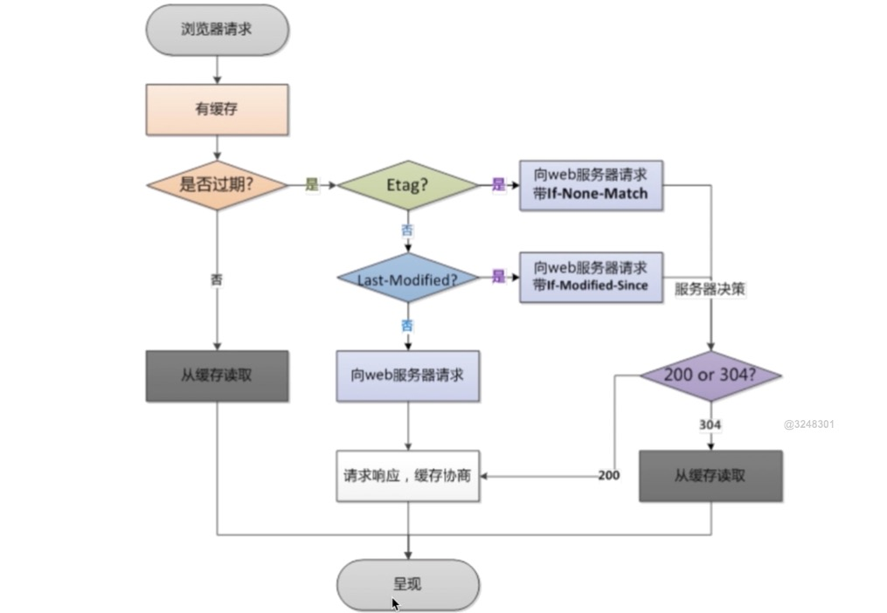


配置语法：

添加Cache-Control 、Expires头，这里主要是respond头信息里面添加

```
Syntax: expires [modified] time;
        expires epoch | max | off;
Default: expires off;
Context: http,server,location,if in location
```

注意一点的是，在实际中，比如谷歌浏览器，即使没有设置上面的内容，他也会自动的进行浏览器缓存，可以观察看到的是第一次返回的状态是200，以后返回的状态是304

### 3.1.6跨站访问

一般浏览器都是禁止同一个页面同时访问两个地址，为的就是方式csrf攻击，避免网站收到黑客的控制，当然了我们可以设置，那么浏览器判断是否可以的条件就是respond头信息中是否有

Access-Control-Allow-Origin 头信息来判断

根据笔者实践认为，一般在代码层面控制，比如PHP

配置语法：

```
Syntax: add_header name value [always];
Default: -
Context: http,server,location,if in location
```

场景配置：

首先写一个前端的页面，加入一下ajax内容

```
$(document).ready(function(){
    $.ajax({
        type:"GET",
        url: "http://2.test.com/1.html",
        success:fucntion(data){
            alert("success");
        },
        error: function(){
            alert("fail");
        }
    });
});
```

然后这个时候访问浏览器，正常情况下，这个ajax会访问失败，那么在nginx中加入一下配置：

```
location ~ .*\.(htm|html)$ {
     add_header Access-Control-Allow-Origin http://2.test.com;
     add_header Access-Control-Allow-Methods GET,POST,PUT,DELETE,OPTIONS;
     root /home/webserver1;
}
```

这个时候再访问浏览器就会成功了。

这里Access-Control-Allow-Origin * 这里如果配置为*的话就意味着允许所有的域名跨域访问，在正式环境中是建议不要这样，以免被黑客利用攻击。

### 3.1.7 防盗链

目的：防止网站资源被盗用，其实就是为了防止其他的网站直接引用本网站的资源，减少请求数。

首要方式：区别哪些请求是非正常的用户请求

基于http_refer防盗链配置模块

配置语法：

```
Syntax: valid_referers none | blocked | server_names | string ...;
Default: -
Context: server,location
```

http_refer就是请求的网址的上一级的网址地址

配置参考：

```
location ~ .*\.(jpg|gif|png)$ {
    # none的意思就是http_refer这个为空是允许的，blocked是代表有refer但是被防火墙或者代理给去除了 
    valid_referers none blocked 192.168.200.20;
    # ngxin会匹配过来的refer，如果匹配到上面配置的，$invalid_referer则为0，否则为1，也就是没有匹配到则返回403错误
    if($invalid_referer){
        # 这里除了返回403之外，其实还可以做其他的，比如rewrite一个新的网址啦，这就看个人设置了
        return 403;
    }
}
```

## 3.2nginx代理服务

简单来说代理服务就是作为一个中间商

代理分类：正向代理、反向代理

正向代理：

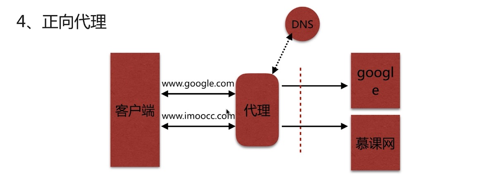

正向代理客户端不需要实现dns中域名和IP的解析，而是由代理去进行的

反向代理：


反向代理客户端去进行dns的域名与ip的解析

总结：

正向代理代理的是客户端，为客户端服务

反向代理代理的是服务端，为服务端服务

### 3.2.1支持的代理类型

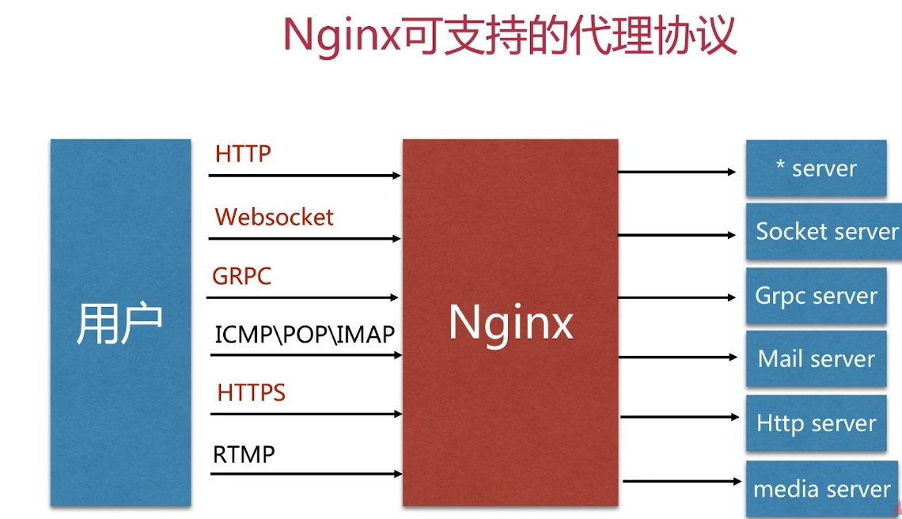

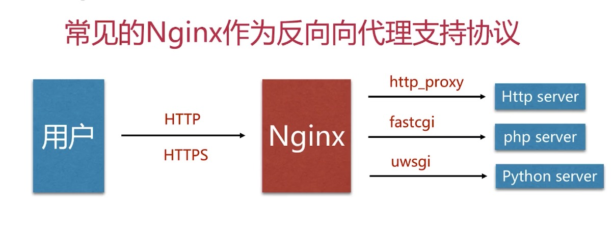

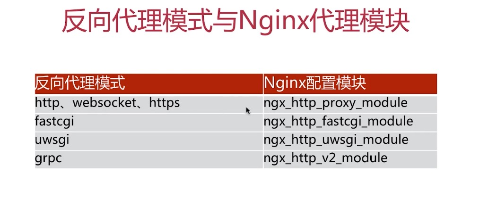

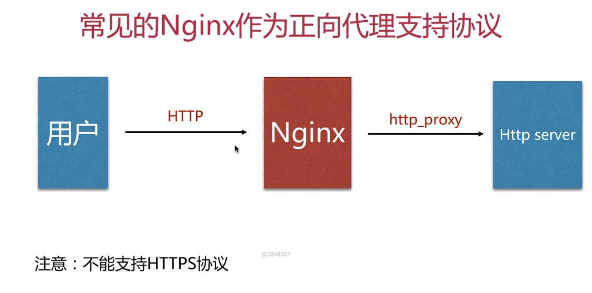

### 3.2.2 配置反向代理

配置语法：

```
Syntax: proxy_pass URL;
Default: -
Context: location,if in location,limit_except
```

首先在/home/webserver2文件夹下面加入test_proxy.html

然后写入：

```
这里是webserver2服务器
```

然后添加配置文件

```
server{
    listen 8080;
    server_name localhost;
    
    location / {
        root /home/webserver2;
        index index.html index.htm;
    }
}
```

然后在/home/webserver1文件夹下面加入index.html

然后添加配置文件

```
server{
   listen 80;
   server_name localhost;
   
   location / {
       root /home/webserver1;
       index index.html index.htm;
   }
   # 当连接中有test_proxy.html这个请求的时候，则代理到8080端口上面上去
   location ~ /test_proxy.html$ {
       proxy_pass http://127.0.0.1:8080;
   }
}
```

然后这个时候打开浏览器访问如下内容：

```
http://192.168.200.20/test_proxy.html
```

从上面的配置中我们知道我们并没有在webserver1文件下面有test_proxy.html，反而是在webserver2下面有，请求也请求到了，正好是文件的内容，所以我们实现了反向代理。

### 3.2.3配置正向代理

需要说明一点，配置正向代理和配置反向代理都是同样的配置语法。

如果想要浏览器访问，需要安装一个代理插件

switchySharp

然后填入代理服务器的名字，地址和IP之后

配置nginx代理服务器

```
server{
    listen 80;
    server_name localhost;
    
    # google的dns解析
    resolver 8.8.8.8;
    location / {
        proxy_pass http://$http_host$request_uri;
    }
}
```

然后这个时候在浏览器输入zhihu.com，浏览器正常返回了，但是可以从代理服务器的日志中找到访问的痕迹，说明代理服务器搭建成功。

### 3.2.4 代理配置语法补充

缓冲区配置：

```
Syntax: proxy_buffering on | off;
Default: proxy_buffering on;
Context: http,server,location
```

扩展：proxy_buffer_size 、proxy_buffers 、 proxy_busy_buffers_size

跳转重定向语法：

```
Syntax: proxy_redirect default;
proxy_redirect off; proxy_redirect redirect replacement;
Default: proxy_redirect default;
Context: http,server,location
```

头信息配置：

```
Syntax: proxy_set_header field value;
Default: proxy_set_header Host $proxy_host
         proxy_set_header Connection close;
Context: http,server,location
```

扩展：proxy_hide_header 、proxy_set_body

超时配置：

```
Syntax: proxy_connect_timeout time;
Default: proxy_connect_timeout 60s;
Context: http,server,location
```

扩展：proxy_read_timeout 、proxy_send_timeout

### 3.2.5企业中常用的配置项

将常用的配置放到一个配置文件中，后续可以直接加载，这些配置是企业中常用的配置

proxy_params 这个文件放到和fastcgi_params、uwsgi_params等放到同一个文件中

```
proxy_redirect default;

proxy_set_header Host $http_host;
proxy_set_header X-Real-IP $remote_addr;

proxy_connect_timeout 30;
proxy_send_timeout 60;
proxy_read_timeout 60;

proxy_buffer_size 32k;
proxy_buffering on;
proxy_buffers 4 128k;
proxy_busy_buffers_size 256k;
proxy_max_temp_file_size 256k;
```

在本次安装中位置是：/etc/nginx

## 3.3nginx作为代理缓存服务器

缓存如果在客户端，就是客户端缓存，这一部分通常是由浏览器进行缓存

缓存如果在nginx端，就是代理缓存

缓存如果是服务器端，就是服务器缓存，通常缓存到redis或者memcached中

缓存到代理服务器的流程：

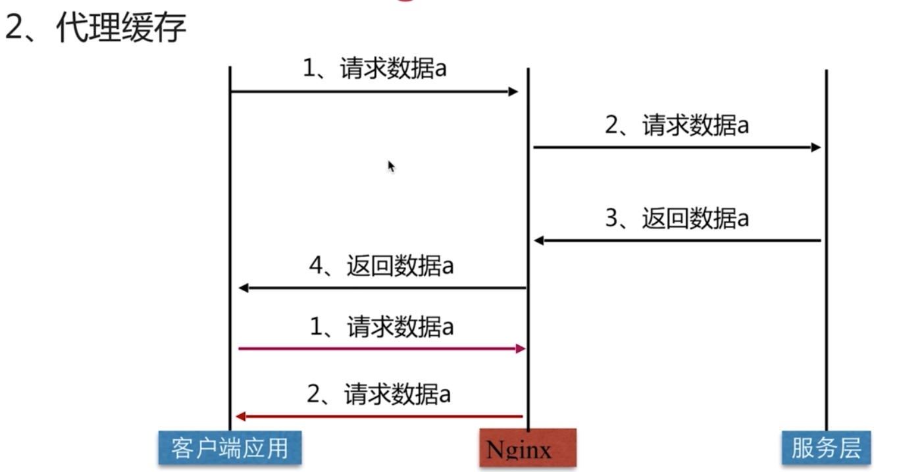


proxy_cache配置语法：

```
Syntax:	proxy_cache_path path [levels=levels] [use_temp_path=on|off] keys_zone=name:size [inactive=time] [max_size=size] [manager_files=number] [manager_sleep=time] [manager_threshold=time] [loader_files=number] [loader_sleep=time] [loader_threshold=time] [purger=on|off] [purger_files=number] [purger_sleep=time] [purger_threshold=time];
Default:	—
Context:	http
```

Proxy_cache配置语法：

```
# 这里的zone是上面配置proxy_cache的名字
Syntax: proxy_cache zone | off;
Default: proxy_cache off;
Context: http,server,location
```

缓存过期周期配置：

```
# time表示多久过期 code比如说200的状态码
Syntax: proxy_cache_valid [code...] time;
Default: -
Context: http,server,location
```

缓存的维度：

```
# 意思就是缓存哪些内容，比如默认的$scheme表示协议，$proxy_host表示域名，$request_uri表示请求的URL
# 当然了，如果想更精细的定义，可以自己配置这个地方
Syntax: proxy_cache_key string;
Default: proxy_cache_key $scheme$proxy_host$request_uri;
Context: http,server,location
```

### 3.3.1nginx作为缓存服务配置演示

下面的配置中出现了upstream配置，这个是nginx作为负载均衡的配置，上面没有出现，但是后面会有写，如果暂时不理解，可以先简单的参考下面的教程来学习一下。

```
https://www.cnblogs.com/wzjhoutai/p/6932007.html
```

关于upstream的配置语法如下：

```
Syntax: upstream name {...}
Default: -
Context: http
```

官方文档地址：

```
http://nginx.org/en/docs/http/ngx_http_upstream_module.html
```

实验开始：

首先配置三个服务器，分别为8001，8002，8003

配置文件如下：

server1.conf

```
server {
     listen 8001;
     server_name localhost;
     
     location / {
         root /home/webserver1;
         index index.html index.htm;
     }
}
```

Server2.conf

```
server {
     listen 8002;
     server_name localhost;
     
     location / {
          root /home/webserver2;
          index index.html index.htm;
     }
}
```

Server3.conf

```
server {
    listen 8003;
    server_name localhost;
    
    location / {
        root /home/webserver3;
        index index.html index.htm;
    }
}
```

然后添加cache_test.conf文件

```
# 配置负载均衡 lunxun表示起的名字，后面的配置需要用的
upstream lunxun {
    server 127.0.0.1:8001;
    server 127.0.0.1:8002;
    server 127.0.0.1:8003;
}
# 这里记录缓存的地址 /home/cache 缓存的文件放到这里 levels表示几级目录 cache_zone为这个缓存起的名字，后面配置需要用到 10m表示开辟zone空间的大小，一般1m可以开启8000个 max_size表示控制/home/cache的大小 inactive 表示60分钟没有用到的给清理到 use_temp_path 会产生问题，建议关掉
proxy_cache_path /home/cache levels=1:2 keys_zone=cache_test:10m max_size=10g inactive=60m use_temp_path=off;

location / {
    # 这里的cache_test就是上面配置的名字
    proxy_cache cache_test;
    # 这里的lunxun就是上面配置的负载均衡的名字
    proxy_pass http://lunxun;
    proxy_cache_valid 200 304 12h;
    proxy_cache_valid any 10m;
    proxy_cache_key $host$uri$is_args$args;
    add_header Nginx-Cache "$upstream_cache_status";
    
    proxy_next_upstream error timeout invalid_header http_500 http_502 http_503 http_504;
    include proxy_params;
}
```

然后打开浏览器就可以看到不会轮训而是对于同一个页面第二次以及以后都是访问的缓存

### 3.3.2配置补充说明

1.如何清理指定缓存？

```
方式一 、 rm -rf 缓存目录内容 # 这种方法会全部删除
方式二 、 第三方扩展模块nginx_cache_purge
```

2.如何让部分页面不缓存？

配置语法：

```
# 这里的string配置哪些页面不缓存
Syntax: proxy_no_cache string ...;
Default: -
Context:http,server,location
```

实验展示：

基于上面的配置文件，我们只需要改动cache_test文件内容即可

```
upstream lunxun {
    server 127.0.0.1:8001;
    server 127.0.0.1:8002;
    server 127.0.0.1:8003;
}

proxy_cache_path /home/cache levels=1:2 keys_zone=cache_test:10m max_size=10g inactive=60m use_temp_path=off;

# 这里配置哪些页面不缓存
if ($request_uri ~ ^/(url3|login|register|password\/reset)){
    set $cookie_nocache 1;
}

location / {
    proxy_cache cache_test;
    proxy_pass http://lunxun;
    proxy_cache_valid 200 304 12h;
    proxy_cache_valid any 10m;
    # 这里应用上面配置的不缓存的页面
    proxy_no_cache $cookie_nocache $arg_nocache $arg_comment;
    proxy_no_cache $http_pragma $http_authorization;
    
    proxy_cache_key $host$uri$is_args$args;
    add_header Nginx-Cache "$upstream_cache_status";
    
    proxy_next_upstream error timeout invalid_header http_500 http_502 http_503 http_504;
    include proxy_params;
}
```

### 3.3.3缓存命中分析

$upstream_cache_status这个包含的内容

| 状态     | 意义                               |
| -------- | ---------------------------------- |
| MISS     | 未命中，请求被传送到后台处理       |
| HIT      | 缓存命中                           |
| EXPIRED  | 缓存已经过期，请求被传送到后台处理 |
| UPDATING | 正在更新缓存，将使用旧的应答       |
| STALE    | 后端得到过期的应答                 |

方式一、通过设置response的头信息Nginx-Cache

```
add_header Nginx-Cache "$upstream_cache_status";
```

在上面的配置文件中我们已经配置过这个选项，现在打来浏览器看到如下信息

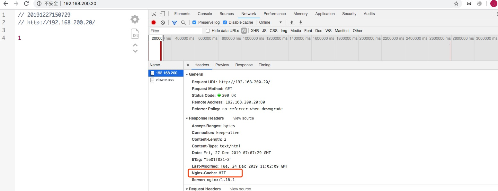

可以看到显示为HIT，这表示命中了，如果是第一次请求则展示为MISS，表示没有命中

方式二 、通过设置log_format，打印日志分析

分析缓存命中率 = HIT次数 / 总请求次数

实现方式：分析Nginx里的Access日志

首先在我们之前的配置文件中(cache_test.conf)加入如下配置

```
# 这里的main就是log_format那里配置的
access_log /var/log/nginx/cache_test.log main;
```

然后在nginx.conf文件的log_format的末尾加入如下配置：

```
' "$upstream_cache_status"'
```

ps：其实可以看的出来，无论是第一种方式还是第二种方式都是利用的$upstream_cache_status这个变量去统计和查看的

设置完成后重启nginx

然后用awk命令在nginx中做如下命令

```
awk '{if($NF=="\"HIT\""){hit++}}END{printf "%.2f",hit/NR}' /var/log/nginx/cache_test.log
```

执行之后就会看到如下内容：

```
1.00 | 0.003 # 这个数值就是统计的命中率
```

### 3.3.4大文件分片请求

配置语法：

```
Syntax: slice size;
Default: slice 0;
Context: http,server,location
```

优势：

每个子请求收到的数据都会形成一个独立文件，一个请求断了，其他请求不受影响

缺点：

当文件很大或者slice很小的时候，可能会导致文件描述符耗尽等情况

## 3.4nginx实现websocket代理

### 3.4.1什么是websocket？

websocket实现是在http连接的基础上，并通过http中的upgrade协议将连接从http升级到websocket。这样就可以实现多次双向通讯，直到连接被关闭。

通信模拟图：

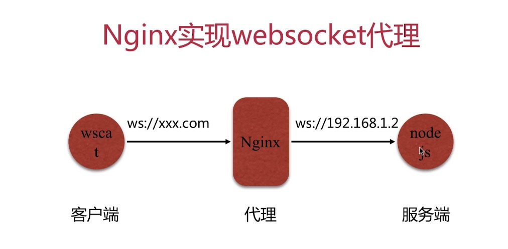

### 3.4.2基于node.js实现websocket代理场景配置演示

在进行演示之前，我们先来补充一个知识点：map

关于这个给出一个参考内容：

```
https://blog.51cto.com/tchuairen/2175525?source=dra
```

当然了，也可以查看官网说明：

```
http://nginx.org/en/docs/http/ngx_http_map_module.html
```

有了上面的内容则可以开始了

#### 3.4.2.1.部署nodejs环境

如果yum本身不支持nodejs模块，则需要预先安装一下，直接执行一下内容就可以安装好了

V8.x

```
curl --silent --location https://rpm.nodesource.com/setup_8.x | bash -
```

V7.x

```
curl --silent --location https://rpm.nodesource.com/setup_7.x | bash -
```

V6.x

```
curl --silent --location https://rpm.nodesource.com/setup_6.x | bash -
```

V5.x

```
curl --silent --location https://rpm.nodesource.com/setup_5.x | bash -
```

以上版本任意选择一个执行就可以了，不过建议选择高版本的安装。

如果不支持npm，则按照下列执行就可以了,以下都是64位的

```
rpm -ivh http://download.fedoraproject.org/pub/epel/6/x86_64/epel-release-6-8.noarch.rpm
rpm --import /etc/pki/rpm-gpg/RPM-GPG-KEY-EPEL-6
rpm -ivh http://rpms.famillecollet.com/enterprise/remi-release-6.rpm
rpm --import /etc/pki/rpm-gpg/RPM-GPG-KEY-remi
```

执行就可以了，然后下面的命令就可以执行了

```
yum install nodejs -y
yum install npm -y
```

 用npm安装模块

```
npm install ws # 用于支持websocket
npm install wscat # 用于测试websocket
```

这里需要说明的是后续会写server.js文件，就是websocket的服务器文件，这个文件和npm install ws这个要在同一个文件，不然无法执行

比如我这里在/home/ws/文件下面安装的

vim server.js

```
console.log("Server started");
var Msg = '';
var WebSocketServer = require('ws').Server
    , wss = new WebSocketServer({port: 8010});
    wss.on('connection', function(ws) {
        ws.on('message', function(message) {
        console.log('Received from client: %s', message);
        ws.send('Server received from client: ' + message);
    });
 });
```

记得要在当然目录下面安装ws

```
npm install ws
```

然后在当前目录下面启动server.js

```
node ./server.js
```

看到打印的内容如下：

```
server started
```

这就说明服务器端启动成功了


#### 3.4.2.2配置nginx配置文件

vim websocket_proxy.conf

```
# 实现映射赋值
map $http_upgrade $connection_upgrade {
    default upgrade;
    '' close;
}

upstream websocket {
    server 127.0.0.1:8010;
}

server {
    listen 8020;
    server_name localhost;
    
    access_log /var/log/nginx/test_websocket_access.log main;
    
    location / {
        proxy_pass http://websocket;
        proxy_http_version 1.1;
        proxy_set_header Upgrade $http_upgrade;
        proxy_set_header Connection $connection_upgrade;
    }
    
}
```

重启nginx

#### 3.4.2.3测试

然后使用wscat工具进行测试

```
wscat --connect ws://127.0.0.1:8020
# 之后出来一个对话框，随便输入点字符即可，如果服务器返回则配置成功
```

如果提示找不到wscat，那肯定是没有被配置到系统环境变量中，如果为了临时的使用

可以在当前安装的模块下面执行一下内容

```
./node_modules/wscat/bin/wscat --connect ws://127.0.0.1:8020
```

经过实验，以上会成功。

## 3.5nginx实现fastcgi配置

在开始搭建之前，认为了解一下PHP是很有必要的，这里关于PHP内核模型推荐一本书

```
http://php-internals.com/
```

当然这本书比较复杂，不过作为一个想要深入PHP内核的人来说，深入阅读本书很有帮助

当然了，下面这个文章也是比较好的

```
https://www.awaimai.com/php
```

不过下面这个更侧重于使用。

### 3.5.1什么是fastcgi？

关于这一部分可以参考下面的文章

```
http://php-internals.com/book/?p=chapt02/02-02-03-fastcgi
```

上面这篇文章从源码的角度来说明了fastcgi，但是需要c语言基础

相反阅读下面的文章就显得平易近人些了

```
https://www.awaimai.com/371.html
```

其实从文章中我们可以得出结论，php-fpm就是fastcgi协议的具体实现，他管理php-cgi进程池。

更进一步可以阅读下面这篇文章，写的就更好一些了

```
https://segmentfault.com/q/1010000000256516
```

### 3.5.2代理结构

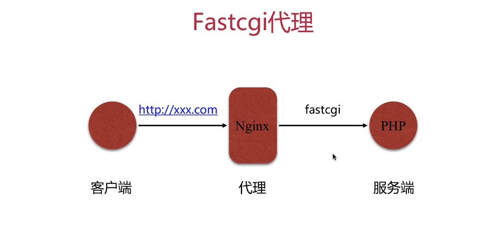

### 3.5.3配置语法

配置语法一：

```
Syntax: fastcgi_pass address;
Default: -
Context: location,if in location
```

关于这个配置可以有如下两种方式：

方式一：

```
fastcgi_pass localhost:9000; # 这里的localhost可以写成IP
```

方式二：

```
fastcgi_pass unix:/tmp/fastcgi.socket
```

配置语法二：

```
Syntax: fastcgi_index name;
Default: -
Context:http,server,location
```

设置默认的首页文件，结合fastcgi_param一起设置

```
Syntax: fastcgi_param parameter value [if_not_empty];
Default: -
Context: http,server,location
```

通过fastcgi_param设置变量，并将设置的变量传递到后端的fastcgi server

举个例子：

```
fastcgi_index index.php
fastcgi_param SCRIPT_FILENAME /home/www/scripts/php$fastcgi_script_name;
```

这个时候浏览器访问http://xxx.com

这个时候

```
SCRIPT_FILENAME=/home/www/scripts/php/index.php # 这个内容会传递到cgi(php就是fastcgi)程序
```

如果浏览器访问：http://xxx.com/page.php

```
SCRIPT_FILENAME=/home/www/scripts/php/page.php # 这个内容会传递到cgi(php就是fastcgi)程序
```

### 3.5.4部署lnmp环境

关于这一部分的内容以及后续的内容请继续阅读nginx资料二，是对这个资料的续集

#### 3.5.4.1部署mariadb数据

这个数据库其实就是可以认为是mysql

```
yum install mariadb -y
```

..