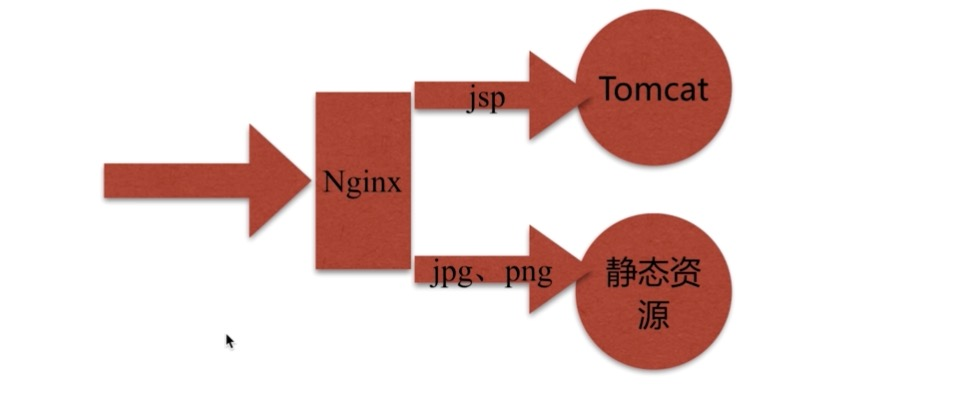
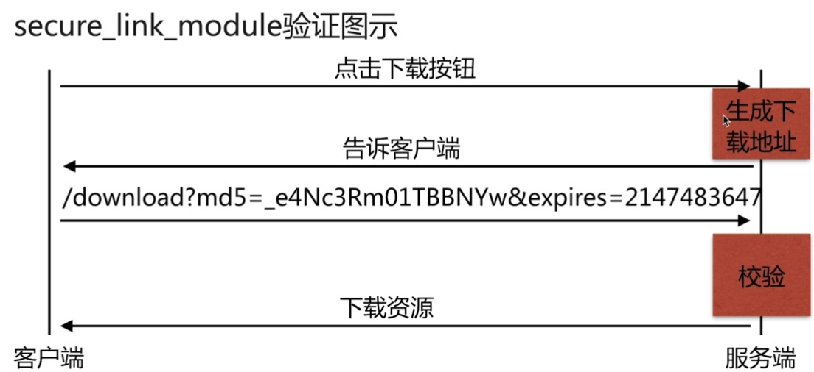
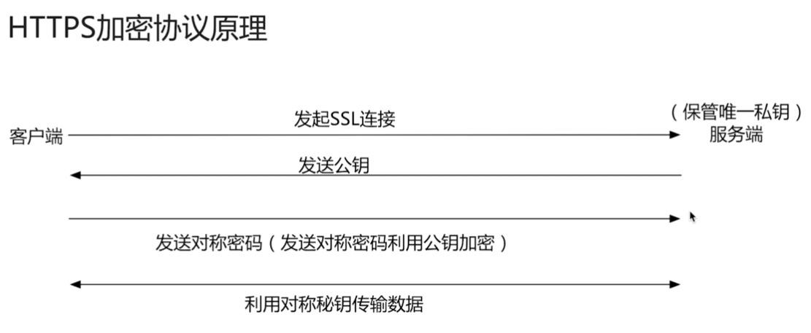
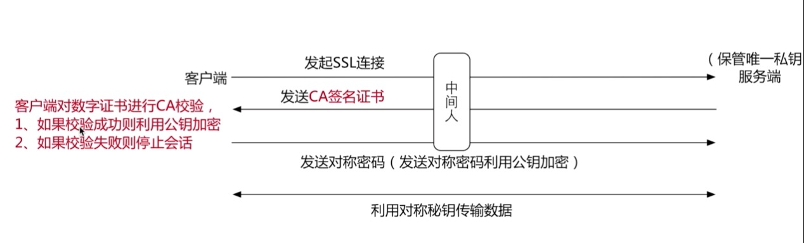

# 一、动静分离

## 1.1什么叫动静分离

通过中间件将动态请求和静态请求分离

## 1.2为什么要动静分离

分离资源，减少不必要的请求消耗，减少请求延时，动态请求需要跟框架和数据库等打交道，而静态页面呢？就是一个页面，nginx可以直接返回

## 1.3演示场景如下



## 1.4配置详情如下

在/home/webserver1下面建立test_mysite.html文件

```
<html lang="en">
<head>
<meta charset="UTF-8" />
<title>测试ajax和跨域访问</title>
<script src="http://libs.baidu.com/jquery/2.1.4/jquery.min.js"></script>
</head>
<script type="text/javascript">
   $(document).ready(function(){
        $.ajax({
             type: "GET",
             url: "http://192.168.200.20/java_test.jsp",
             success: function(data){
                 $("#get_data").html(data);
             },
             error: function(){
                 alert("falil!!!,请刷新重试！");
             }
        });
   });
</script>

<body>
   <h1>测试动静分离</h1>
   
   <div id="get_data"></div>
</body>
</html>
```

然后在nginx的配置文件中建立test_mysite.conf文件，文件内容如下

```
upstream java_api{
     server 127.0.01:8080;
}
server {
    listen 80;
    server_name localhost;
    
    access_log /var/log/nginx/log/host_access.log main;
    root /home/webserver1;
    
    # 对于动态内容，请求这里
    location ~ \.jsp$ {
        proxy_pass http://java_api;
        index index.html index.htm;
    }
    
    # 对于静态内容，请求这里
    location ~ \.(jpg|png|gif)$ {
        expires 1h;
        gzip on;
    }
    
    location / {
        index index.html index.htm;
    }  
}
```

在tomcat的webapps/ROOT/ 目录下面建立java_test.jsp文件

```
<%@ page language="java" import="java.util.*" pageEncoding="utf-8"%>
<HTML>
    <HEAD>
        <TITLE>jsp test page</TITLE>
    </HEAD>
    <BODY>
        <%
            Random rand = new Random();
            out.println("<h1>Random number:</h1>");
            out.println(rand.nextInt(99)+100);
        %>
    </BODY>
</HTML>
```


启动tomcat，然后重新加载nginx，在浏览器访问页面

```
192.168.200.20/test_mysite.html
```

结论：对于jsp这种动态的内容，会被代理转发到tomcat下面去，对于静态内容，比如png这种图片，会直接返回

这也是很多网站为啥出来一部分图片，而很多动态内容无法出来的现象

## 1.5测试结果

通过上面的配置文件我们可以看到nginx的配置文件中upstream中使用了"_"下划线这种内容，对于tomcat来说又些版本是不支持的，这里有个坑，可以把下划线去掉。

# 二、Rewrite规则模块

## 2.1什么是rewrite？

实现URL重写以及重定向，主要用到正则匹配

## 2.2使用场景

1）URL访问跳转，支持开发设计、页面跳转、兼容性支持、展示效果等

2）seo优化

3）维护 ：后台维护、流量转发等

4）安全

## 2.3配置语法

```
# regex就是用正则匹配的内容 replacement就是要替换成为的内容 flag是匹配到之后执行的操作，如break等
Syntax: rewrite regex replacement [flag];
Default: -
Context: server,location,if
```

下面是一个例子：

```
rewrite ^(.*)$  /pages/maintain.html break;
```

## 2.4正则表达式

| 正则  | 作用                               |
| ----- | ---------------------------------- |
| .     | 匹配除换行符以外的任意字符         |
| ?     | 重复0次或1次                       |
| +     | 重复1次或更多次                    |
| *     | 有多少就匹配多少                   |
| \d    | 匹配数字                           |
| ^     | 匹配字符串的开始                   |
| $     | 匹配字符串的结尾                   |
| {n}   | 重复n次                            |
| {n,}  | 重复n次或更多次                    |
| [c]   | 匹配单个字符c                      |
| [a-z] | 匹配a-z小写字母的任意一个          |
| \     | 转义字符                           |
| ( )   | 用于匹配括号之间的内容，通过$1调用 |

关于这一部分可以用pcretest工具来进行测试

## 2.5flag

| 类型      | 作用                                        |
| --------- | ------------------------------------------- |
| last      | 停止rewrite检测，直接返回404                |
| break     | 停止rewrite检测，重新建立请求               |
| redirect  | 返回302临时重定向，地址栏会显示跳转后的地址 |
| permanent | 返回301永久重定向，地址栏会显示跳转后的地址 |

redirect临时重定向每次都会向服务器去请求，permanent就会在第一次请求后在浏览器端保存住，以后不会请求服务器

## 2.6rewrite的优先级

以下等级依此降低，在前面的最先被匹配

1）执行server块的rewrite指令

2）执行location匹配

3）执行选定的location中的rewrite

# 三、高级模块

## 3.1secure_link_module模块

### 3.1.1作用

1.指定并允许检查请求的链接的真实性以及保护资源免于遭未经授权的访问

2.限制链接生效周期

### 3.1.2配置语法

配置语法一：

```
Syntax: secure_link expression;
Default: -
Context: http,server,location
```

配置语法二：

```
Syntax: secure_link_md5 expression;
Default: -
Context: http,server,location
```

### 3.1.3验证机制图示



说明：md5是为了验证链接的有效性，expires验证资源的过期时间

### 3.1.4配置场景

```
location / {
     # 匹配URL中的md5和expires参数
     secure_link $arg_md5,$arg_expires;
     # 针对url中md5加密的字符串进行匹配 ，其实这里就是加密的规则，miyao就是加密的salt盐值
     secure_link_md "$secure_link_expires$uri miyao";
     
     # 写if的时候记得和后面的（中间加个空格，不然会报错
     
     # 如果匹配的不存在，则返回403
     if ($secure_link = "") {
          return 403;
     }
     
     # 如果返回的错误则返回410
     if ($secure_link = "0") {
           return 410;
     }
}
```

生成访问的URL字符串shell

```shell
#!/bin/sh
#
#Auth:miss
servername="192.168.200.20"
download_file="/download/file.img"
time_num=$(date -d "2019-12-30 00:00:00" +%s)
secret_num="miyao"

res=$(echo -n "${time_num}${download_file} ${secret_num}"|openssl md5 -binary | openssl base64 | tr +/ -_ | tr -d =)

echo "http://${servername}${download_file}?md5=${res}&expires=${time_num}"
```

生成的测试地址如下：

```
http://192.168.200.20/download/file.img?md5=dOHCq4uliCZe_xrQK0slPg&expires=1577635200
```

这个时候在浏览器端进行访问，如果出错了，是不会正常返回的，这个可以在防盗链的时候进行配置和文件下载

## 3.2geoip_module模块

关于这一部分，可以阅读下面文档

```
https://docs.nginx.com/nginx/admin-guide/dynamic-modules/geoip/
```

### 3.2.1作用是什么？

基于IP地址匹配MaxMind GeoIP二进制文件，读取IP所在地域信息

### 3.2.2安装

默认情况下nginx是没有安装这个模块的，如果是yum安装，命令如下

```
yum install nginx-module-geoip
```

安装完成之后会在/etc/nginx/modules/目录下面有对应的模块内容

### 3.2.3使用场景

1.区别国内外做HTTP访问规则

2.区别国内城市地域做http访问规则

### 3.2.4场景演示

编辑nginx.conf文件加载geoip模块内容，因为不是安装编译进去的

vim nginx.conf

```
# 这个不可以放到events模块的后面，否则会报错
load_module "modules/ngx_http_geoip_module.so";
load_module "modules/ngx_stream_geoip_module.so";

events {
   # ...
}
http {
   #...
}
```

下载地址文件

```
wget http://geolite.maxmind.com/download/geoip/database/GeoLiteCountry/GeoIP.dat.gz
wget http://geolite.maxmind.com/download/geoip/database/GeoLiteCity.dat.gz
```

上面的地址是官方提供的地址，但是笔者写这份材料的时候，需要付费下载了，地址已经变化了，之所以留着是因为域名还是有效的，但是可以参考下面的地址进行下载

```
https://src.fedoraproject.org/lookaside/pkgs/GeoIP/GeoIP.dat.gz/
https://src.fedoraproject.org/lookaside/pkgs/GeoIP/GeoLiteCity.dat.gz/
```


进行解压

```
gunzip GeoIP.dat.gz
gunzip GeoLiteCity.dat.gz
```

vim  test_geo.conf

```
# 读取IP文件
geoip_country /etc/nginx/geoip/GeoIP.dat;
# 读取城市文件
geoip_city /etc/nginx/geoip/GeoLiteCity.dat;

server {
    listen 80;
    server_name localhost;
    
    location / {
         # 如果国家的IP不是中国，则返回403，目前没办法测试，没有外国IP，但是这个配置是成功的
         if ($geoip_country_code != CN) {
               return 403;
         }
         root /home/webserver1;
         index index.html index.htm;
    }
    
    location /myip {
         default_type text/plain;
         # 获取自己的出口IP
         return 200 "$remote_addr $geoip_country_name $geoip_country_code $geoip_city";
    }
}
```

# 四基于nginx的https服务

## 4.1https的原理和作用



上面的方式难以防止中间人的劫持，加上ca证书之后就可以避免，也就是下面这种方式



这里的CA证书就是大家都找一个信任的第三方

## 4.2生成CA证书

不过这种生成的证书在浏览器会提示风险，没有提示风险的需要付费购买，不过这个过程和付费的一样

生成前提：

1.确认安装了openssl

2.确认nginx安装了--with-http_ssl_module模块

步骤一：生成key秘钥

```
# 确认安装了openssl
openssl version
# 确认nginx支持ssl
nginx -V

# 创建文件夹
mkdir ssl_key
# 进入文件夹
cd ssl_key

# 生成key秘钥
openssl genrsa -idea -out jesonc.key 1024

......
# 接下来需要输入一个密码，这个密码一定要记住，后续需要用
# 我这里的密码就是1234

# 然后就生成了jesonc.key文件了
```


步骤二：生成证书签名请求文件（csr文件）

```
# 生成请求文件
openssl req -new -key jesonc.key -out jesonc.csr

...
# 接下来按照提示输入内容

# 最后就生成了jesonc.csr文件
```

到这里一步，按照公司的，付费的那种，需要打包给第三方公司来生成最终的CA证书，但是这里我们就自己生成了，要花钱啊！

步骤三：生成证书签名文件（CA文件）

```
# 这里3650是有效期，必须要加，如果不加，默认是1个月
openssl x509 -req -days 3650 -in jesonc.csr -signkey jesonc.key -out jesonc.crt

# 输入密码，就是上面的那个密码1234
```

## 4.3nginx的https语法配置

配置语法一：

```
Syntax: ssl on | off;
Default: ssl off;
Context: http,server
```

配置语法二：

```
Syntax: ssl_certificate file;
Default: -
Context: http,server
```

配置语法三：

```
Syntax: ssl_certificate_key file;
Default: -
Context: http,server
```

## 4.4配置nginx的文件

```
server {
    # 这里一定要写443
    listen 443;
    server_name localhost;
    
    # 开启https
    ssl on;
    ssl_certificate /etc/nginx/ssl_key/jesonc.crt;
    ssl_certificate_key /etc/nginx/ssl_key/jesonc.key;
    #ssl_certificate_key /etc/nginx/ssl_key/jesonc_nopass.key;
    
    index index.html index.htm;
    
    location / {
         root /home/webserver1;
    }
}
```

## 4.5测试上面的配置

首先重启nginx，这个时候需要输入密码，也就是上面生成key的那个密码，也可以生成不需要，后面再说

```
netstat -luntp | grep 443 # 通过这个命令查看443端口是否开启
```

然后打开浏览器访问

```
https://192.168.200.20 # 这里一定要加入https，不然访问的就是http
```

这个时候就是会提示有风险，这个就是因为是我们自己生成的，如果是第三方付费公司生成的，就不会有的。

## 4.6配置苹果要求的https服务

### 4.6.1苹果对https证书的要求

1.服务器所有的链接使用TLS1.2以上版本（openssl 1.0.2）

2.https证书必须使用SHA256以上哈希算法签名

3.https证书必须使用RSA 2048位或ECC 256位以上公钥算法

4.使用前向加密技术

### 4.6.2直接生成CA证书

之前都是先生成key文件，然后生成中间文件csr，然后再生成crt文件，这次不需要，之前每次重启都需要输入密码，这次不需要

```
openssl req -days 36500 -x509 -sha256 -nodes -newkey rsa:2048 -keyout jesonc.key -out jesonc_app.crt

....
# 按照提示输入内容
```

对于上面的第一个例子可以用如下的方式去掉密码，但是本次不需要

```
openssl rsa -in ./jesoncold.key -out ./jesoncou_nopas.key
```

### 4.6.3编写nginx配置文件

```
server {
    # 这里一定要写443
    listen 443;
    server_name localhost;
    
    # 开启https
    ssl on;
    ssl_certificate /etc/nginx/ssl_key/jesonc_apple.crt;
    ssl_certificate_key /etc/nginx/ssl_key/jesonc.key;
    
    index index.html index.htm;
    
    location / {
         root /home/webserver1;
    }
}
```

上面的配置文件要在nginx1.5版本之前，之后的话用如下方式书写

```
server {
    # 这里一定要写443 ,之前的ssl on 在这里改成ssl即可
    listen 443 ssl;
    server_name localhost;
    
    ssl_certificate /etc/nginx/ssl_key/jesonc_apple.crt;
    ssl_certificate_key /etc/nginx/ssl_key/jesonc.key;
    
    index index.html index.htm;
    
    location / {
         root /home/webserver1;
    }
}
```

这个在第一个同样有效

### 4.6.4测试

重启nginx，打开浏览器进行访问

## 4.7https优化

方法一：激活keepalive长链接

方法二：设置ssl session缓存

```
ssl_session_cache shared:SSL:10m;
ssl_session_timeout 10m;
```