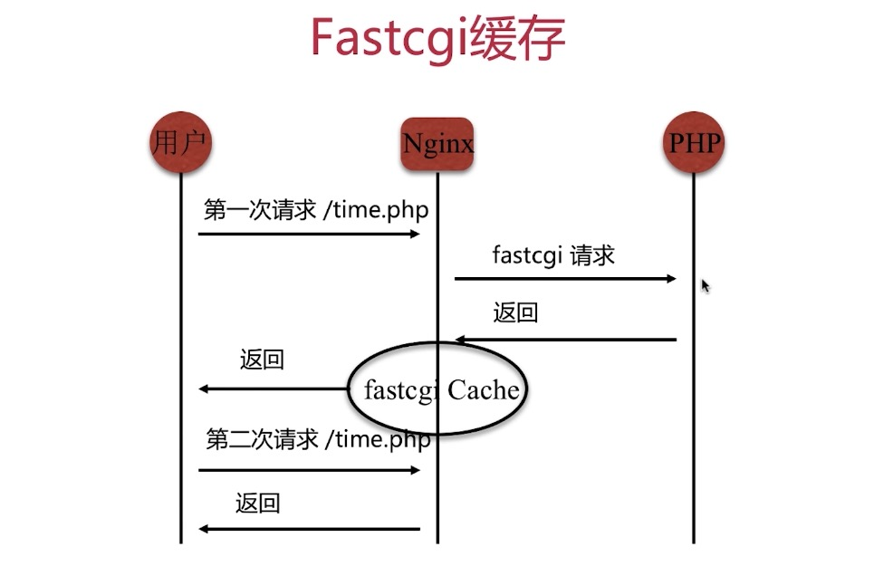
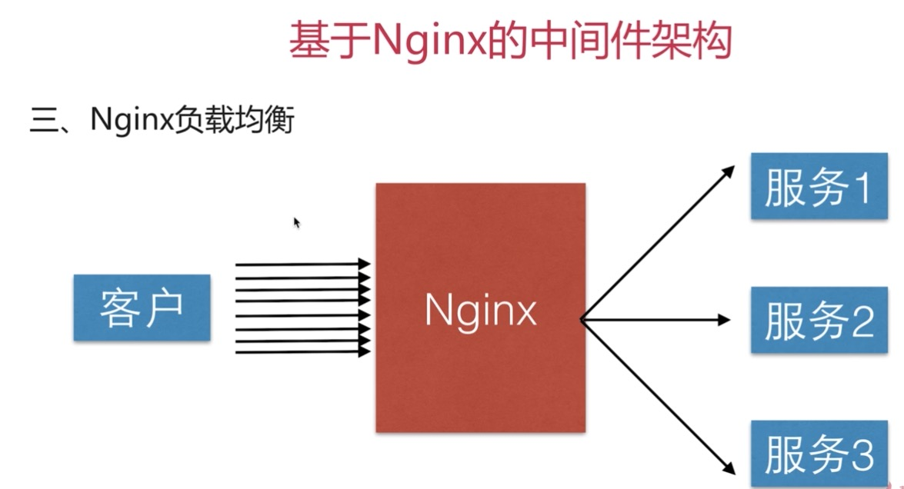

这个是承接nginx资料一的内容

### 3.5.4部署lnmp环境

#### 3.5.4.1安装mariadb数据库

这个数据库其实可以认为是mysql数据库

```
yum install mariadb -y
```

#### 3.5.4.2安装PHP环境

关于这里可以参考下面的帖子内容查看

```
http://www.imoocc.com/jeson/2018/07/11/nginxfastcgi/ (阅读密码:lfsdfsdf)
```

添加支持yum repo源

```
yum install http://rpms.remirepo.net/enterprise/remi-release-7.rpm 

yum install yum-utils 

yum-config-manager --enable remi-php72
```

安装PHP的模块

```
yum install php72-php-fpm php72-php-common php72-php-mbstring php72-php-xmlrpc php72-php-soap php72-php-gd php72-php-xml php72-php-intl php72-php-mysql php72-php-cli php72-php-zip php72-php-curl
```

查看PHP的版本

```
php72 -version
```

#### 3.5.4.3启动php-fpm

通过上面我们知道php-fpm就是fastcgi协议的实现，他管理php-cgi进程池，那么我们就先来启动它，然后再让nginx进行转发内容到他启动的端口上面即可了。

按照上面的方式安装之后，可以找到php-fpm得主配置文件如下

```
/etc/opt/remi/php72/php-fpm.conf
```

从配置文件如下

```
/etc/opt/remi/php72/php-fpm.d/www.conf
```

查看当前php-fpm的状态

```
systemctl status php72-php-fpm.service
```

停止php-fpm

```
systemctl stop php72-php-fpm.service
```

启动php-fpm

```
systemctl start php72-php-fpm.service
```

#### 3.5.4.4建立nginx的配置文件

```
server {
    listen 8090;
    server_name localhost;
    
    access_log /var/log/nginx/wds_server_access.log main;
    root /home/webserver1;
    
    location / {
         index index.php index.html;
    }
    
    location ~ \.php$ {
         # 代理转发请求到php-fpm的9000端口，
         fastcgi_pass   127.0.0.1:9000;
         fastcgi_index  index.php;
         include        fastcgi_params;
         fastcgi_param  SCRIPT_FILENAME $document_root$fastcgi_script_name;
    }
}
```

#### 3.5.4.5写PHP文件

在/home/webserver1文件下面加入info.php,写入PHP内容

#### 3.5.4.6测试

在浏览器访问即可

### 3.6搭建wordpress博客系统

#### 3.6.1安装mariadb-server

```
yum install -y mariadb-server
```

启动

```
systemctl start mariadb.service
```

#### 3.6.2这一部分就到此结束，这是作为一个PHP开发者基本的

截止到目前，发现wordpress好像不能用了

###3.7fastcgi缓存配置演示



配置语法一：

设置缓存的空间，路径，大小等

```
Syntax: fastcgi_cache_path path [levels=levels] keys_zone=name:size [inactive=time] [max_size=size]...;
Default: -
Context: http
```

配置语法二：

定义缓存的维度，其实就是缓存啥

```
Syntax: fastcgi_cache_key string;
Default: -
Context: http,server,location
```

配置语法三：

zone就是上面fastcgi_cache_path的zone

```
Syntax: fastcgi_cache zone | off;
Default: fastcgi_cache off;
Context: http,server,location
```

配置语法四：

```
# 定义例如200、304这种缓存的时间
Syntax: fastcgi_cache_valid [code...] time;
Default: -
Context: http,server,location
```

缓存配置文件例子：

```
fastcgi_cache_path /home/cache levels=1:2 keys_zone=cache_test:100m max_size=1g inactive=60m;

server {
    listen 8090;
    server_name localhost;
    
    access_log /var/log/nginx/wds_server_access.log main;
    root /home/webserver1;
    
    location / {
         index index.php index.html;
         try_files $uri $uri/ /index.php?$args;
         if($request_uri ~ "/admin/"){
             set $is_nocache yes;
         }
    }
    
    location ~ \.php$ {
         # 代理转发请求到php-fpm的9000端口，
         fastcgi_pass   127.0.0.1:9000;
         fastcgi_index  index.php;
         include        fastcgi_params;
         fastcgi_param  SCRIPT_FILENAME $document_root$fastcgi_script_name;
         
         # 缓存内容
         fastcgi_cache_key $scheme$request_method$host$request_uri$is_args$args;
         fastcgi_cache cache_test;
         fastcgi_cache_valid 200 60m;
         
         add_header X-cache-Source $upstream_cache_status;
    }
}
```

### 3.8 no-cache头对于nginx缓存的影响

即使nginx设置了缓存，如果PHP代码端设置了no-cache头信息的话，那么nginx将不会进行fastcgi的缓存

当然了nginx是可以设置忽略头信息的

```
fastcgi_ignore_headers Cache-Control Expires Set-Cookie;
```

这样即使PHP有设置也只会让nginx端的生效

### 3.9fastcgi_cache_key设置影响

定义了维度，就是缓存什么

如果设置的维度过小的话，将会造成一些严重的影响，比如只缓存主机名的话，无论后面再有任何请求参数，都只会到主机，所以这个越详细越好。

## 4Uwsgi反向代理模式

cgi--->fastcgi--->wigs--->uwsgi

上面是演进形式，uwsgi就是为python实现的

###4.1安装python3环境

这个参考手记来安装

```
http://www.imooc.com/article/26870
```

然后安装django

```
/home/python3.6/bin/pip3 install django
```

然后安装uwsgi

```
/home/python3.6/bin/pip3 install uwsgi
```

### 4.2配置uwsgi

```
cd /home
mkdir uswgi-code conf

cd uswgi-code
# 创建django工程
/home/python3.6/bin/django-admin.py startproject demo

cd demo
cd demo

# 创建uwsgi用户
useradd uwsgi

cd /home/conf/
vim uwsgi.ini

------------------
[uwsgi]
socket = 127.0.0.1:9999
workers = 2
max-requests = 1000
buffer-size = 30000
pidfile = /var/run/uwsgi/uwsgi.pid # 记得给权限
daemonize = /var/log/uwsgi.log
-------------------

su - uwsgi

# 启动uwsgi
/home/python3.6/bin/uwsgi --ini ./uwsgi.ini
```

### 4.3配置nginx

````
server {
    listen 8090;
    server_name localhost;
    
    location / {
         include uwsgi_params;
         uwsgi_pass 127.0.0.1:9999;
         # 按照模块化方式请求
         uwsgi_param UWSGI_SCRIPT demo.wsgi;
         uwsgi_param UWSGI_CHDIR /home/uswgi-code/demo;
         index index.html index.htm;
         client_max_body_size 35m;
    }
}
````

### 4.4 测试

这里配置是有问题的，后面我在自己搞一搞吧

## 5.nginx配置负载均衡



### 5.1配置语法

```
Syntax: upstream name {...}
Default: -
Context:http
```

### 5.2实验

关于这个部分，我上面有配置过了，参考那个就行了，当其中某个节点挂掉的时候，就会自动剔除那个节点

### 5.3后端服务器在负载均衡调度中的状态

| 参数         | 作用                                |
| ------------ | ----------------------------------- |
| down         | 当前的server暂时不参与负载均衡      |
| backup       | 预留的备份服务器                    |
| max_fails    | 允许请求失败的次数                  |
| fail_timeout | 经过max_fails失败后，服务暂停的时间 |
| max_conns    | 限制最大的接收的连接数              |

上面参数放置的位置如下演示：

```
upstream test {
   server 192.168.200.20:8001 down;
   server 192.168.200.20:8002 backup;
}
```

### 5.4轮询策略

调度算法

| 方法         | 作用                                                         |
| ------------ | ------------------------------------------------------------ |
| 轮询         | 按时间顺序逐一分配到不同的后端服务器                         |
| 加权轮询     | weight值越大，分配到的访问几率越高                           |
| ip_hash      | 每个请求按访问Ip的hash结果分配，这样来自同一个IP的固定访问一个后端服务器 |
| url_hash     | 按照访问的URL的hash结果来分配请求，是每个URL定向到同一个后端服务器 |
| least_conn   | 最少连接数，哪个机器连接数少就分发                           |
| hash关键数值 | hash自定义的key                                              |

加权轮询演示

```
upstream test {
		# 权重越高越容易被分配到
   server 192.168.200.20:8001 weight=5;
   server 192.168.200.20:8001;
}
```

ip_hash演示

```
upstream test {
   # 这样配置即可
	 ip_hash;
	 
   server 192.168.200.20:8001;
   server 192.168.200.20:8001;
}
```

自定义

配置语法：1.7.2版本以后出现

```
Syntax：hash key [consistent];
Default: -
Context: upstream
```

演示

```
upstream test {
   # 对于同一个url访问来的就会定位到同一个服务器
   hash $request_uri;
	 
   server 192.168.200.20:8001;
   server 192.168.200.20:8001;
}
```


