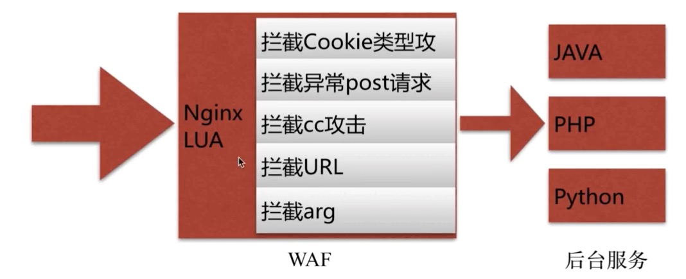

# 一、nginx常见的问题

## 1.1 相同server_name多个虚拟主机优先级访问

例如server1

```
server {
   listen 80;
   server_name testserver1 jeson.t.imooc.io;
   location / {
       ....
   }
}
```

server2

```
server {
    listen 80;
    server_name testserver2 jeson.t.imooc.io;
   location / {
       ...
   } 
}
```

从上面两个可以看出来，第一个和第二个配置中server_name中都出现了相同的jeson.t.imooc.io，那么在启动nginx的话只会提示warn，但是是可以开启成功的。

那么优先级是先读取哪个呢？

经过验证，先写的先读取，这个时候访问jeson.t.imooc.io先读到哪个，哪个就展示。

## 1.2 多个location匹配的优先级

| 匹配符 | 作用                                 |
| ------ | ------------------------------------ |
| =      | 进行普通字符精确匹配，也就是完全匹配 |
| ^ ～   | 表示普通字符匹配，使用前缀匹配       |
| ～\\~* | 表示执行一个正则匹配( )              |

以上优先级依此降低，第一个最高，后面的逐渐降低

## 1.3 try_files使用

作用：按照顺序检查文件是否存在

例如：

```
location / {
    # 首先nginx拿到这个之后先去寻找是否存在$uri这个目录，如果不存在，就交给第二个,也就是后面加个/,也就是
    # $uri/ 这个目录是否存在，如果还不存在，就去查找 index.php这个文件
    # 总的来说就是从前面的文件依此去找到是否有后面的文件地址
    try_files $uri $uri/ /index.php;
}
```

## 1.4 alias和root的使用区别

root就是指定程序所在的目录

例如下面的配置：

```
location / {
     root /home/webserver1;
}
```

这个时候浏览器访问

```
http://www.test.com/index/name.html
```

他寻找的目录就是如下的

```
/home/webserver1/index/name.html
```

那么如果是alias则寻找的是如下的

```
/home/webserver1/name.html
```

## 1.5 用什么方法传递用户真实的IP信息

其实就是在一级代理设置变量

```
set x_real_ip=$remote_addr
```

这样子后面的多级代理就可以直接取到实际的IP地址

下面是一个等待验证的IP伪造例子，有时间可以测试一下

```
https://juejin.im/entry/5b037ccaf265da0ba2674f3e
```

## 1.6 nginx中常见的错误码

1.如果出现

```
Nginx: 413 Request Entity Too Large
```

原因就是用户上传文件限制 client_max_body_size

2.如果出现502 bad gateway

后端服务无响应

3.504Gateway Time-out

后端服务执行超时

# 二、nginx的性能优化

## 2.1 性能优化需要考虑的点

1.当前系统结果瓶颈

​      观察指标、压力测试

2.了解业务模式

​      接口业务类型、系统层次化结构

3.性能和安全

## 2.2 ab压测工具

1.安装

```
yum install httpd-tools
```

2.使用

```
ab -n 2000 -c 2 http://127.0.0.1
-n 总的请求数
-c 并发数
-k 是否开启长链接
```

## 2.3 文件句柄

文件句柄说白了，就是liunx中打开的文件的个数，可以简单的这么理解，默认的Linux是限制1024个，对于nginx是远远不够的，所以我们需要重新设置

那么设置方式来说有三种：

1.系统全局性修改

2.用户局部性修改

3.进程局部性修改

在Linux操作系统中有个修改文件句柄的文件

```
/etc/security/limits.conf
```

打开这个文件

```
# root表示针对root用户，soft表示超过了也没关系，hard表示超过了可能直接限制了
root soft nofile 65535
root hard nofile 65535
# * 代表所有用户设置文件个数
*    soft nofile 65535
*    hard nofile 65535
```

那么到了nginx端设置如下内容，一下内容写在nginx.conf文件中

```
worker_rlimit_nofile 65535 # 这里就实现了针对nginx的限制
```

## 2.4 cup亲和

作用：把进程通常不会在处理器之间频繁迁移进程迁移的频率小，减少性能损耗

查看当前Linux的cpu物理个数

```
cat /proc/cpuinfo|grep "physical id"|sort|uniq|wc -l
```

查看每个物理cpu的核数

```
cat /proc/cpuinfo|grep "cpu cores"|uniq
```

物理cpu乘以每个cpu的核数，就是总的核数

现在来修改nginx.conf文件

```
# 表示启动多少个worker进程，官方建议跟linux的核心数保持一致
worker_processes 2;
# 配置每个cpu和work的对应关系
# worker_cpu_affinity 01 10; # 这种方式比较麻烦，如果cpu的核心数比较多少的时候就要很长
worker_cpu_affinity auto; # 这种方式就很好了，可以实现自动绑定核心,1.9版本出来的
```

关于这一部分，可以参考下面的帖子

```
https://www.cnblogs.com/thatsit/p/nginx-cpu-qin-he-xing-diao-zheng.html
```

## 2.5通用配置

```
events {
    # 采用epoll模型，这个优势不言而喻
    use epoll;
    # 限制每个work可以连接多少个数
    worker_connections 10240;
}

# 设置使用的字符集，这里写成utf-8
charset utf-8;

# 对于静态资源的处理
sendfile on;

# 压缩配置
gzip on;
# 对于IE6不进行兼容压缩
gzip_disable "MSIE [1-6]\.";
gzip_http_version 1.1;
```

# 三、nginx安全

## 3.1常见的恶意行为

爬虫行为和恶意抓取、资源盗用

使用基础的防盗链功能-目的不让恶意用户能轻易的爬取网站对外数据

secure_link_module-对数据安全性提高加密验证和实效性，适合如核心重要数据

access_module-对后台、部分用户服务的数据提供IP防控

## 3.2常见的攻击手段

1.后台密码撞库-通过猜测密码字典不断对后台系统登录行尝试，获取后台登陆密码

方法：

设置复杂的密码

access_module对后台提供IP防控

预警机制

2.文件上传漏洞-利用这些可以上传的接口将恶意代码植入到服务器中，再通过URL去访问以执行代码

在早起的nginx版本中，如上传了一个1.jpg，虽然是一个jpg，但是实际上是PHP代码

这个时候去执行如下内容：

```
http://www.test.com/upload/1.jpg/1.php
```

Nginx将1.jpg作为PHP代码执行，导致出现漏洞

Ps:这个漏洞我没有测试过，后面我去测试一下

为了避免这个漏洞，可以配置如下内容：

```
location ^ ~ /upload {
    root /home/webserver/images;
    # 如果在静态文件这里有PHP文件，则返回403，不让其执行
    if ($request_filename ~*(.*)\.php) {
         return 403;
    }
}
```

不过我找到了如下文章可以一看：

```
https://blog.csdn.net/wn314/article/details/77388289/
```

## 3.3 sql注入

sql注入-利用未过滤/未审核用户输入的攻击方法，让应用运行本不应该运行的sql代码




现成的别人写好的

```
https://github.com/loveshell/ngx_lua_waf
```

# 四、nginx新特性

## 4.1 nginx平滑升级

参考下面的帖子

```
https://www.imooc.com/article/73175
```


# 五、完结散花

历经磨难，终于写完了内容，累死了，去做个大保健休息一下啦！

